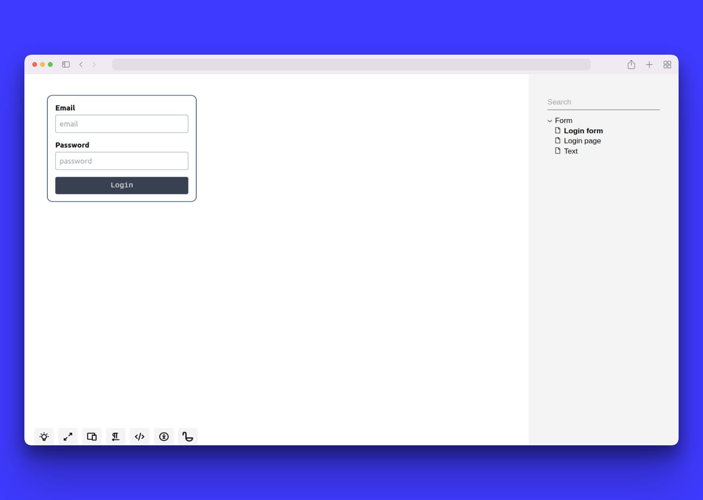

# Tailwind development with Ladle

Your quick description.



## How to develop?

```bash
# using pnpm is adviced
pnpm install

# start ladle in development mode
pnpm dev

# build it as a static site
pnpm build
```
